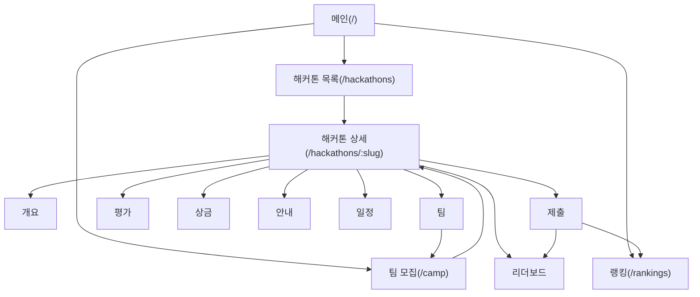
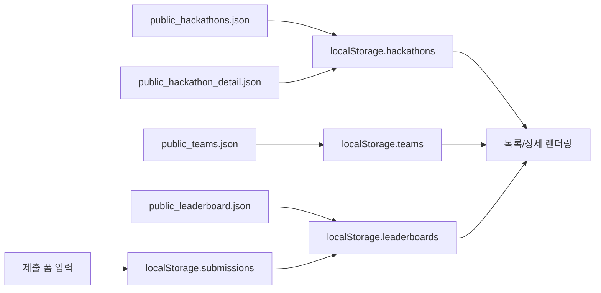

# VibeCoder Hackathon Website Master Spec

이 문서는 `VibeCoder Hackathon Hub` 노션의 핵심 실행/참고 문서를 통합한 단일 개발 기준서입니다.

## 1) 프로젝트 개요

- 프로젝트명: 긴급 인수인계 해커톤 웹사이트 구현
- 핵심 목표:
  - 제공된 자료(JSON + 명세) 기반으로 웹사이트 완성
  - 팀 아이디어 확장 기능 1개 추가
  - Vercel 배포 링크 제출
- 필수 마감(2026, KST):
  - 기획서: 2026-03-30 10:00
  - 최종 웹링크: 2026-04-06 10:00
  - 최종 솔루션 PDF: 2026-04-13 10:00

## 2) 평가 기준 요약

- 1차 평가: 참가팀 30% + 심사위원 70%
- 상위 10팀: 내부 정성평가(100%)
- 배점:
  - 기본 구현 30
  - 확장(아이디어) 30
  - 완성도 25
  - 문서/설명 15

개발 전략:
- 기본 구현 + 완성도 먼저 확보
- 확장 기능은 1개를 깊게
- 문서/발표는 재현 가능한 시나리오 중심

### 2.1 이 문서에서 가장 먼저 봐야 하는 우선순위

이 프로젝트는 기능을 많이 만드는 것보다, 아래 4개 평가 항목을 의식해서 구현하는 것이 더 중요합니다.

1. 기본 구현 30
   - 웹 페이지 구현도
   - 데이터 기반 렌더링
   - 필터/정렬 동작
   - 빈 상태 UI
2. 확장(아이디어) 30
   - 팀 고유 기능/UX 개선
   - 서비스 가치가 보이는 확장
   - 억지스럽지 않은 일관된 흐름
3. 완성도 25
   - 사용성(동선/가독성)
   - 안정성(오류/예외 처리)
   - 성능(로딩/반응성)
   - 접근성/반응형
4. 문서/설명 15
   - 기획서의 명확성
   - PPT의 설계/구현 설명력
   - 실행/검증 방법의 재현성

### 2.2 점수 역산 기준으로 한 구현 원칙

- `기본 구현 30`:
  - `/`, `/hackathons`, `/hackathons/:slug`, `/camp`, `/rankings`가 모두 살아 있어야 함
  - JSON + localStorage 기반 렌더링이 명확해야 함
  - 목록/랭킹에서 최소 1개 이상의 필터 또는 정렬이 실제 동작해야 함
  - 빈 상태 UI가 반드시 보여야 함
- `확장 30`:
  - 확장 기능은 여러 개보다 1개를 깊게 구현
  - 제출 → 리더보드 반영, 팀 모집 UX, 제출 체크 흐름 같은 서비스형 확장이 유리함
- `완성도 25`:
  - 모바일(375~430px) 대응
  - 에러/빈값/잘못된 slug 처리
  - 버튼/폼/탐색 흐름이 자연스러워야 함
- `문서/설명 15`:
  - 기획서와 PPT에서 실제 웹사이트 흐름을 재현 가능하게 설명
  - 심사자가 "어떻게 검증하면 되는지" 바로 따라할 수 있어야 함

## 3) 웹사이트 동작 파이프라인 (페이지 흐름)



## 4) 데이터 파이프라인 (JSON + localStorage)



### 4.1 원본 데이터 파일

- `/Users/a1234/Downloads/data/예시자료/public_hackathons.json`
- `/Users/a1234/Downloads/data/예시자료/public_hackathon_detail.json`
- `/Users/a1234/Downloads/data/예시자료/public_leaderboard.json`
- `/Users/a1234/Downloads/data/예시자료/public_teams.json`

### 4.2 localStorage 키 규칙 (고정)

- `hackathons`
- `teams`
- `submissions`
- `leaderboards`

### 4.3 초기화/동기화 규칙

1. 최초 진입 시 localStorage가 비어 있으면 JSON으로 초기화
2. 사용자 생성/수정 데이터는 localStorage 우선
3. `team.hackathonSlug`로 상세/캠프/랭킹 연결
4. 제출 저장 시 `submissions` 저장 + `leaderboards` 갱신

## 5) 페이지별 기능 명세

### 5.1 공통 (모든 페이지)

MUST:
- 상단 네비게이션: `/`, `/hackathons`, `/camp`, `/rankings`
- 로딩/빈 데이터/에러 3상태 처리
- 모바일 반응형(375~430px) 대응

SHOULD:
- 잘못된 경로 복귀 버튼
- 공통 UI 톤/간격/버튼 규칙 유지

### 5.2 메인 `/`

- 큰 CTA 3개:
  - 해커톤 보러가기 → `/hackathons`
  - 팀 찾기 → `/camp`
  - 랭킹 보기 → `/rankings`

### 5.3 해커톤 목록 `/hackathons`

MUST:
- 리스트 렌더링: `title`, `status`, `tags`, 기간
- 카드 클릭 → `/hackathons/:slug`

OPTION:
- 상태 필터(예정/진행/종료)
- 태그 필터

### 5.4 해커톤 상세 `/hackathons/:slug`

필수 섹션(8):
- 개요(Overview)
- 팀(Teams/Camp)
- 평가(Eval)
- 상금(Prize)
- 안내(Info)
- 일정(Schedule)
- 제출(Submit)
- 리더보드(Leaderboard)

핵심 동작:
- slug 기반 상세 렌더링
- 팀 섹션 ↔ `/camp` 연동
- 제출 완료 시 리더보드 갱신

### 5.5 팀 모집 `/camp`

MUST:
- 팀 목록 조회
- 팀 생성
- `?hackathon=slug` 필터 지원

팀 생성 필드(MUST):
- 팀명
- 소개
- 모집중 여부(`isOpen`)
- 모집 포지션(`lookingFor`)
- 연락 링크(`contact.url`)

OPTION:
- 채팅/쪽지 링크
- 모집 마감 처리

### 5.6 랭킹 `/rankings`

MUST:
- 글로벌 랭킹 테이블: `rank`, `teamName(or nickname)`, `score`
- 최신 업데이트 시각 표시

OPTION:
- 기간 필터(최근 7일/30일/전체)

## 6) JSON 매핑 기준

### `public_hackathons.json`
- 목록 데이터
- 주요 필드: `slug`, `title`, `status`, `tags`, `thumbnailUrl`, `period`, `links.detail`

### `public_hackathon_detail.json`
- 상세 섹션 데이터
- 주요 필드: `overview`, `info`, `eval`, `schedule`, `prize`, `teams`, `submit`, `leaderboard`
- 대상 slug: `daker-handover-2026-03`

### `public_teams.json`
- 팀 모집 데이터
- 주요 필드: `teamCode`, `hackathonSlug`, `name`, `isOpen`, `memberCount`, `lookingFor`, `intro`, `contact`

### `public_leaderboard.json`
- 랭킹 데이터
- 주요 필드: `hackathonSlug`, `entries[]`
- 확장 필드: `scoreBreakdown`, `artifacts(webUrl/pdfUrl/planTitle)`

## 7) 제출/리더보드 동작 규칙

1. 유저가 상세 페이지 제출 폼 작성
2. `submissions` 저장
3. 저장 성공 시 `leaderboards` 업데이트
4. 상세 리더보드와 `/rankings`에서 즉시 반영

## 8) 상태/예외 처리 규칙

- 데이터 없음: 안내 문구 + 다음 액션 버튼
- 로딩 실패: 재시도 버튼
- 잘못된 slug: "존재하지 않는 해커톤" 안내
- 제출 실패: 실패 안내 + 재시도
- 필수값 누락: 인라인 검증 메시지

## 9) 공개/보안/라이선스 규칙

공개 금지:
- 내부 유저 정보
- 유저 비공개 정보
- 타 팀 내부 정보

라이선스:
- 코드/이미지/폰트/아이콘 저작권 준수
- 무단 복제/도용 금지

외부 API/DB:
- 심사자가 별도 키 없이 확인 가능해야 함

## 10) 기술 스택

### 10.1 필수

- HTML
- CSS
- JavaScript (ES6+)
- Vercel (배포)
- GitHub (코드/제출)
- localStorage
- JSON 더미데이터

### 10.2 현재 사용 중

- React (19.2.4)
- React Router DOM (7.13.2)
- TypeScript (5.9.3)
- CSS Modules

### 10.3 개발 환경

- Node.js
- npm (패키지 매니저)
- Vite (번들러)
- VS Code
- Chrome DevTools
- ESLint + TypeScript

## 11) 폴더 구조 (현재)

```text
vivecoding/
  ├─ public/
  │  └─ data/
  │     ├─ public_hackathons.json
  │     ├─ public_hackathon_detail.json
  │     ├─ public_teams.json
  │     └─ public_leaderboard.json
  ├─ src/
  │  ├─ App.tsx                        # 최상위 라우터 설정 (React Router)
  │  ├─ main.tsx                       # 진입점
  │  ├─ types.ts                       # 전역 타입 정의
  │  ├─ vite-env.d.ts                  # Vite 환경 타입
  │  ├─ assets/                         # 이미지, 폰트 등 정적 자산
  │  ├─ components/
  │  │  ├─ Layout.tsx                  # 공용 레이아웃 (TopNav 포함)
  │  │  ├─ Layout.module.css
  │  │  ├─ StateBlocks.tsx             # 상태 렌더링 (로딩/에러/빈상태)
  │  │  └─ StateBlocks.module.css
  │  ├─ pages/
  │  │  ├─ HomePage.tsx                # / 페이지
  │  │  ├─ HomePage.module.css
  │  │  ├─ HackathonsPage.tsx          # /hackathons 페이지
  │  │  ├─ HackathonsPage.module.css
  │  │  ├─ HackathonDetailPage.tsx    # /hackathons/:slug 페이지
  │  │  ├─ HackathonDetailPage.module.css
  │  │  ├─ CampPage.tsx               # /camp 페이지
  │  │  ├─ CampPage.module.css
  │  │  ├─ RankingsPage.tsx           # /rankings 페이지
  │  │  ├─ RankingsPage.module.css
  │  │  ├─ NotFoundPage.tsx           # 404 페이지
  │  ├─ store/
  │  │  ├─ AppDataContext.tsx         # 전역 상태 (React Context API)
  │  │  └─ dataStore.ts               # localStorage 유틸리티
  │  └─ styles/
  │     └─ global.css                  # 전역 스타일
  ├─ VibeCoder_Website_Master_Spec.md  # 이 문서
  ├─ VibeCoder_Website_Walkthrough.md
  ├─ SiteInspire_UI_Iteration_5Rounds.md
  ├─ Design_Iteration_Log_2025.md
  ├─ README.md
  ├─ package.json
  ├─ tsconfig.json
  ├─ vite.config.js
  ├─ eslint.config.js
  └─ index.html
```

## 12) 협업 방식 (초보팀 권장)

핵심:
- 프론트/백 분리보다 `한 저장소 + 기능 단위 분담`
- 데모 3개 제작 후 1개를 main 기준으로 확정
- 4/1 이후 신규 기능 금지, 버그 수정 중심

역할 분담:
- A: `/`, `/hackathons`, `/rankings` + 공통 네비
- B: `/hackathons/:slug` 섹션 + 제출 폼
- C: `/camp` + localStorage 연결 + 배포

브랜치 규칙:
- `feat/home-list-rank`
- `feat/detail-submit`
- `feat/camp-storage`
- `fix/mobile-layout`
- `fix/router-error`

충돌 방지:
- 같은 파일 동시 수정 금지
- 머지 전 스크린샷/30초 동작 공유
- localStorage 키명 변경 금지
- 병합 전: 라우팅/모바일/콘솔에러 점검

## 13) 프로젝트 보드 운영 규칙

보드: `09_프로젝트 보드 (실행)`

주요 필드:
- 작업(Title)
- 상태(시작 전/진행 중/완료)
- 담당(People)
- 시작일, 마감일
- 우선순위
- 메모

운영:
- 하루 시작 시 작업 1개를 `진행 중`으로 변경
- 종료 시 보드 + 회의록 + 체크리스트 동시 업데이트

## 14) 회의록 운영 규칙

- 원칙: `회의 1회 = 페이지 1개`
- 회의 끝나기 전 `결정사항`, `액션아이템(담당/마감)` 필수 기입
- 액션아이템은 보드에도 반영

## 15) 제출물 규칙

필수 제출물:
- 기획서(1차)
- 웹 페이지 배포 URL(Vercel)
- GitHub 저장소 링크
- 솔루션 설명 PDF(PPT 기반)

제출 직전 점검:
- Vercel 외부망 접속
- GitHub 접근 가능
- PDF 업로드 완료
- 핵심 시연 동선 점검
- 모바일 최소 점검

## 16) Definition of Done (평가 기준 기준)

### 16.1 기본 구현 30

- [ ] `/`, `/hackathons`, `/hackathons/:slug`, `/camp`, `/rankings` 동작
- [ ] 상세 8섹션 렌더링
- [ ] JSON 초기화 로직 동작
- [ ] localStorage 우선 반영
- [ ] 4개 키 통일(`hackathons`, `teams`, `submissions`, `leaderboards`)
- [ ] 목록/랭킹에서 필터 또는 정렬이 실제 동작
- [ ] 빈 상태 UI 존재

### 16.2 확장(아이디어) 30

- [ ] 확장 기능 1개가 분명하게 정의되어 있음
- [ ] 확장 기능이 서비스 가치와 연결됨
- [ ] 기존 흐름을 해치지 않고 자연스럽게 이어짐
- [ ] 제출/팀/리더보드 중 최소 1개 흐름을 더 좋게 만듦

### 16.3 완성도 25

- [ ] 로딩/빈상태/에러 처리
- [ ] 잘못된 slug 또는 예외 접근 처리
- [ ] 모바일(375~430px) 정상 동작
- [ ] 콘솔 에러 없음
- [ ] 버튼/입력/탐색 흐름이 자연스러움

### 16.4 문서/설명 15

- [ ] 기획서에 서비스 개요/페이지 구성/시스템 구성/핵심 기능 명세 포함
- [ ] PPT에 문제-구현-확장-검증 흐름 포함
- [ ] 심사자가 따라할 수 있는 QA/시연 순서 존재
- [ ] 기획서/웹링크/PDF 마감 준수

## 17) QA 시나리오 (최소)

1. 메인에서 해커톤 목록 진입
2. 목록 카드 클릭 후 상세 진입
3. 상세 팀 섹션에서 캠프 이동/팀 생성
4. 상세 제출 섹션 저장
5. 상세 리더보드 및 `/rankings` 반영 확인
6. 모바일 화면에서 동일 시나리오 반복

## 18) 참고 자료

사이트:
- http://rwdb.kr
- https://www.awwwards.com/inspiration/responsive-design
- https://land-book.com/
- https://onepagelove.com/
- https://www.lapa.ninja/
- https://mobbin.com/discover/apps/web
- https://refero.design/

유튜브(한국어):
- https://www.youtube.com/@coohde
- https://www.youtube.com/@dream-coding
- https://www.youtube.com/@nomadcoders
- https://www.youtube.com/@ZeroChoTV

---

문서 버전: v1.1  
기준 소스: VibeCoder Hackathon Hub (노션) 통합  
권장 사용법: 작업 전 `00_START HERE` 확인 후 본 문서 섹션 3~7 기준으로 구현
